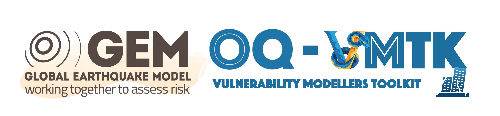

[]
(https://github.com/GEMScienceTools/oq-vmtk/actions/workflows/windows_test.yaml)
[]
(https://github.com/GEMScienceTools/oq-vmtk/actions/workflows/linux_test.yaml)

<a id="readme-top"></a>

<!-- PROJECT SHIELDS -->

[![Contributors][contributors-shield]][contributors-url]
[![Forks][forks-shield]][forks-url]
[![Stargazers][stars-shield]][stars-url]
[![Issues][issues-shield]][issues-url]
[![project_license][license-shield]][license-url]


<!-- PROJECT LOGO -->
<br />
<div align="center">
  <a href="https://github.com/GEMScienceTools/vulnerability-toolkit">
    
  </a>

  <h3 align="center">Vulnerability Modeller's ToolKit (OQ-VMTK)</h3>

  <p align="center">
    This repository contains an open source library that provides modelling of multi-degree-of-freedom systems and assessment via nonlinear time-history analyses for regional vulnerability and risk calculations. The vulnerability toolkit is developed by the Global Earthquake Model (GEM) Foundation and its collaborators.
    <br />
    <a href="https://github.com/GEMScienceTools/vulnerability-toolkit/docs"><strong>Explore the docs »</strong></a>
    <br />
    <br />
    <a href="https://github.com/GEMScienceTools/vulnerability-toolkit/demos">View Demos</a>
    ·
    <a href="https://github.com/GEMScienceTools/vulnerability-toolkit/issues/new?labels=bug&template=bug-report---.md">Report Bug</a>
    ·
    <a href="https://github.com/GEMScienceTools/vulnerability-toolkit/issues/new?labels=enhancement&template=feature-request---.md">Request Feature</a>
  </p>
</div>


# ✨ Key Features

The OQ-VMTK is a powerful toolkit developed by scientists at the Global Earthquake Model (GEM) Foundation. Designed for earthquake engineers and catastrophe modellers, it provides a comprehensive OpenSees-based platform for running representative (idealised) models, developing fragility and vulnerability assessments, and offering extensive flexibility in defining seismic demand, structural capacity, damage criteria, and damage-to-loss conversion.

## 🏗️ Single/Multi-Degree-of-Freedom System Modeling
- Effortlessly create single- and multi-degree-of-freedom models using intuitive low-level parameters.
- Define structures with key attributes like storey count, first-mode transformation factors, and force-deformation relationships.

## 🔍 Comprehensive Analysis Suite
### 📊 Linear & Nonlinear Analysis
- **Modal Analysis:** Extract vibration periods and mode shapes with precision.
- **Gravity Analysis:** Perform gravity analysis and ensure system stability before running advanced simulations.
- **Nonlinear Static Analysis:** Perform static and cyclic pushover tests to assess the system's lateral load resisting capacity, dissipated energy and other metrics.
- **Dynamic Time-History Analysis:** Simulate dynamic response of structures using selected ground-motion records.

### 🌍 Seismic Fragility & Vulnerability Assessment
- **Fragility Analysis:** Characterize EDP|IM relationships using Cloud Analysis and determine damage exceedance probabilities (accounting for record-to-record variability & modeling uncertainty).
- **Storey Loss Function Generation:** Generate storey loss functions based on user-specific inventory of structural and nonstructural components and building contents.
- **Vulnerability Analysis:** Derive vulnerability functions to estimate economic and human-based decision variables, incorporating damage-to-loss ratios and/or storey loss functions.

### 📈 Powerful Visualization & Plotting Tools
- Generate insightful plots for:
  - **Model Overview:** Nodes and elements in your OpenSees model.
  - **Cloud Analysis Results:** Fitted IM|EDP relationships.
  - **Seismic Demand Profiles:** Peak storey drifts and floor accelerations.
  - **Fragility Functions:** Visualize probability-based structural performance.
  - **Storey Loss Functions:** Visualize storey loss function simulations and models.
  - **Vulnerability Functions:** Understand risk and loss estimates.

# 🚀 Get Started

## 👩‍💻🧑‍💻 Installation

Follow these steps to install the `oq-vmtk` package and its dependencies. Note that this procedure implies the installation of the OpenQuake engine dependencies. This procedure was tested on Windows and Linux OS.
It is highly recommended to use a **virtual environment** to install this tool. A virtual environment is an isolated Python environment that allows you to manage dependencies for this project separately from your system’s Python installation. This ensures that the required dependencies for the OpenQuake engine do not interfere with other Python projects or system packages, which could lead to version conflicts.

### 1. Clone the Repository
   Open your terminal,  and run:
   ```bash
   cd <virtual_environment_directory>
   git clone https://github.com/GEMScienceTools/oq-vmtk.git
   cd oq-vmtk
   ```

### 2. Set Up a Virtual Environment (Recommended)
   Create a virtual environment to manage dependencies:
   ```bash
   python -m venv .venv  # On Windows
   python3 -m venv .venv  # On Linux
   ```

   Activate the virtual environment:
   ```bash
   .venv\Scripts\activate  # On Windows
   source .venv/Scripts/activate  # On Linux
   ```

### 3. Install Dependencies
   Install the required packages listed in `requirements.txt`.

   **For Windows Users:** Install the appropriate requirements file based on your Python version:
   ```bash
   pip install -r requirements-py310-win64.txt  # Python 3.10
   pip install -r requirements-py311-win64.txt  # Python 3.11
   pip install -r requirements-py312-win64.txt  # Python 3.12
   ```
   **For Linux Users:** Install the appropriate requirements file based on your Python version:
   ```bash
   pip install -r requirements-py310-linux64.txt  # Python 3.11
   pip install -r requirements-py311-linux64.txt  # Python 3.11
   pip install -r requirements-py312-linux64.txt  # Python 3.12
   ```
   **For macOS Users:** OpenSeesPy does not currently support macOS versions running on arm64 processors, such as M1 and M2 chips. As a result, newer OpenSeesPy versions are not available for macOS. To use OpenSeesPy on a Mac, it is advised to run a virtual machine with Linux or Windows.

   **Note:** to check your current python version, run the following command
   ```bash
   python --version
   ```

## 📼 Demos

The repository includes demo scripts that showcase the functionality of the vulnerability-modellers-toolkit (oq-vmtk). You can find them in the demos folder of the repository.

To run a demo, simply navigate to the demos directory and execute the relevant demo script in Jupyter Lab. Jupyter Lab is automatically installed with oq-vmtk.

### 1. Activate the virtual environment:

  ```bash
  .venv\Scripts\activate  # On Windows
  source .venv/Scripts/activate  # On Linux
  ```

  **Note:** to deactivate virtual environment:
  ```bash
   deactivate
  ```

### 2. Open Jupyter Lab from the terminal:

  ```bash
   jupyter-lab
  ```

### 3. Navigate to the "demos" folder
### 4. Run the examples

# © License

This work is licensed under an AGPL v3 license (https://www.gnu.org/licenses/agpl-3.0.en.html)

[](https://www.gnu.org/licenses/agpl-3.0)

# 📚 Documentation

[WIP]

# 📑 References

[WIP]

# 🤝 Contributions

You can follow the instructions indicated in the [contributing guidelines](./contribute_guidelines.md)

# 🌟 Contributors

Contributors are gratefully acknowledged and listed in CONTRIBUTORS.txt.

<a href="https://github.com/GEMScienceTools/vulnerability-toolkit/graphs/contributors">
  
</a>

<p align="right">(<a href="#readme-top">back to top</a>)</p>

<!-- MARKDOWN LINKS & IMAGES -->
<!-- https://www.markdownguide.org/basic-syntax/#reference-style-links -->
[contributors-shield]: https://img.shields.io/github/contributors/GEMScienceTools/vulnerability-toolkit.svg?style=for-the-badge
[contributors-url]: https://github.com/GEMScienceTools/vulnerability-toolkit/graphs/contributors
[forks-shield]: https://img.shields.io/github/forks/GEMScienceTools/vulnerability-toolkit.svg?style=for-the-badge
[forks-url]: https://github.com/GEMScienceTools/vulnerability-toolkit/network/members
[stars-shield]: https://img.shields.io/github/stars/GEMScienceTools/vulnerability-toolkit.svg?style=for-the-badge
[stars-url]: https://github.com/GEMScienceTools/vulnerability-toolkit/stargazers
[issues-shield]: https://img.shields.io/github/issues/GEMScienceTools/vulnerability-toolkit.svg?style=for-the-badge
[issues-url]: https://github.com/GEMScienceTools/vulnerability-toolkit/issues
[license-shield]: https://img.shields.io/github/license/GEMScienceTools/vulnerability-toolkit.svg?style=for-the-badge
[license-url]: https://github.com/GEMScienceTools/vulnerability-toolkit/blob/master/LICENSE.txt
