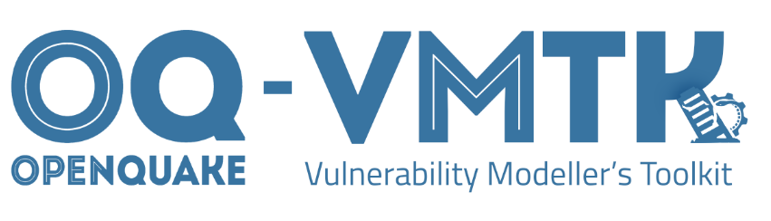

[](https://doi.org/10.5281/zenodo.17524871)
[](https://github.com/GEMScienceTools/oq-vmtk/actions/workflows/windows_test.yaml)
[](https://github.com/GEMScienceTools/oq-vmtk/actions/workflows/linux_test.yaml)

<a id="readme-top"></a>

[![Contributors][contributors-shield]][contributors-url]
[![Forks][forks-shield]][forks-url]
[![Stargazers][stars-shield]][stars-url]
[![Issues][issues-shield]][issues-url]
[![project_license][license-shield]][license-url]

<br />
<div align="center">
  <a href="https://github.com/GEMScienceTools/oq-vmtk">
    
  </a>

  <h3 align="center">Vulnerability Modeller's ToolKit (OQ-VMTK)</h3>

  <p align="center">
    An open-source Python toolkit for earthquake structural modelling, nonlinear analysis, and seismic vulnerability assessment — developed by the Global Earthquake Model (GEM) Foundation.
    <br /><br />
    <a href="https://gemsciencetools.github.io/oq-vmtk/"><strong>Documentation »</strong></a>
    &nbsp;·&nbsp;
    <a href="https://github.com/GEMScienceTools/oq-vmtk/tree/main/demos">Demos</a>
    &nbsp;·&nbsp;
    <a href="https://github.com/GEMScienceTools/oq-vmtk/issues/new?labels=bug&template=bug-report---.md">Report a Bug</a>
    &nbsp;·&nbsp;
    <a href="https://github.com/GEMScienceTools/oq-vmtk/issues/new?labels=enhancement&template=feature-request---.md">Request a Feature</a>
  </p>
</div>

---

## Overview

OQ-VMTK is a Python library for regional seismic vulnerability and risk modelling. It provides a self-contained workflow — from ground motion processing and structural model compilation through nonlinear analysis to fragility and vulnerability function derivation, powered by [OpenSeesPy](https://openseespydoc.readthedocs.io).

The toolkit is designed for earthquake engineers and model developers, who need a reproducible and standardised library of functions to integrate to their structural assessment workflows. 

---

## Modules

| Module | Description |
|--------|-------------|
| `calibration` | Calibrates storey-based force–deformation relationships for MDOF stick-and-mass models from SDOF capacity curves. |
| `modeller` | Compiles and runs SDOF and MDOF structural models in OpenSeesPy: modal analysis, gravity, static/cyclic pushover, and nonlinear time-history analysis (including incremental dynamic analyses). |
| `imcalculator` | Reads ground motion record files and computes a wide range of intensity measures (PGA, PGV, PGD, SA, AvgSA, Arias Intensity, CAV, D5–95, FIV3). |
| `imselection` | Evaluates and ranks intensity measure candidates for seismic demand modelling using Efficiency, Proficiency, Practicality, and the Relative Sufficiency Measure (RSM). |
| `postprocessor` | Derives probabilistic seismic demand models, fragility and vulnerability functions from nonlinear analysis results (Modified Cloud Analysis, Multiple Stripe Analysis, Incremental Dynamic Analysis). Supports lognormal CDFs, GLMs, ordinal CLMs, and MCMC methods. |
| `slfgenerator` | Generates storey loss functions (SLFs) from damageable component inventory data (structural, nonstructural, and contents). |
| `plotter` | Produces publication-quality figures for all stages of the workflow: model geometry, seismic demand profiles, fragility functions, vulnerability curves, SLFs, and more. |
| `utilities` | Helper functions for I/O, data format conversion, and interoperability with OpenQuake Engine outputs. |

---

## Key Features

### Structural Modelling
- Compile idealised SDOF and MDOF stick-and-mass models directly in Python via OpenSeesPy.
- Calibrate MDOF inter-storey properties from SDOF capacity curves to achieve consistency in fundamental period and modal participation.
- Run modal analysis, static/cyclic pushover, gravity analysis, and nonlinear time-history analysis within a unified API.

### Ground Motion Processing
- Batch-process ground motion record files to extract scalar and spectral intensity measures.
- Compute response spectra and a full suite of IMs (SA, AvgSA, PGA, PGV, PGD, AI, CAV, D5–95, FIV3).
- Rank and select optimal IMs for seismic demand modelling using the Relative Sufficiency Measure.

### Fragility Assessment
- **Modified Cloud Analysis (MCA):** Fit probabilistic seismic demand models (log-linear regression) and derive fragility functions, with bootstrapped and Bayesian (MCMC) uncertainty quantification.
- **Multiple Stripe Analysis (MSA):** Derive fragility functions from hazard-consistent ground motion suites via Maximum Likelihood Estimation.
- **Incremental Dynamic Analysis (IDA):** Scale records to collapse using the Hunt, Trace and Fill algorithm and derive fragility functions by the Method of Moments.
- Nine fragility fitting approaches including lognormal CDF variants, GLM (logit/probit), ordinal CLMs (constant and variable dispersion), and MCMC.

### Vulnerability & Loss Assessment
- Combine fragility functions with consequence models (damage-to-loss ratios) to derive mean vulnerability functions with explicit uncertainty treatment (Beta distribution, explicit and Silva 2019 COV methods).
- Apply storey loss functions to derive component-level and system-level vulnerability models.
- Compute Average Annual Damage Probability (AADP) and Average Annual Loss Ratio (AALR) by integrating with site hazard curves.

---

## Demo Notebooks

The `demos/` directory contains thirteen self-contained Jupyter notebooks covering the full vulnerability workflow:

| Demo | Description |
|------|-------------|
| `IntensityMeasureProcessing` | Ground motion record processing and intensity measure extraction |
| `IntensityMeasureSelection` | IM selection using the Relative Sufficiency Measure (MCA and IDA) |
| `ModelCompilation` | SDOF and MDOF model calibration and compilation |
| `ModalAnalysis` | Modal analysis and dynamic property verification |
| `PushoverAnalysis` | Monotonic and cyclic static pushover analysis |
| `NonlinearTimeHistoryAnalysis` | Nonlinear time-history analysis and demand profile extraction |
| `ModifiedCloudAnalysis` | End-to-end vulnerability assessment using Modified Cloud Analysis |
| `MultipleStripeAnalysis` | End-to-end vulnerability assessment using Multiple Stripe Analysis |
| `IncrementalDynamicAnalysis` | End-to-end vulnerability assessment using Incremental Dynamic Analysis |
| `FragilityAnalysis` | Comparison of all supported fragility fitting methods |
| `StoreyLossFunctionGeneration` | Generating storey loss functions from component inventory data |
| `StoreyLossFunctionApplication` | Deriving system-level vulnerability models using storey loss functions |

---

## Installation

It is strongly recommended to install OQ-VMTK inside a **virtual environment** to avoid dependency conflicts with the OpenQuake Engine requirements.

### 1. Clone the Repository

```bash
git clone https://github.com/GEMScienceTools/oq-vmtk.git
cd oq-vmtk
```

### 2. Create and Activate a Virtual Environment

```bash
# Create
python -m venv .venv          # Windows
python3 -m venv .venv         # Linux / macOS

# Activate
.venv\Scripts\activate        # Windows
source .venv/bin/activate     # Linux / macOS
```

To deactivate later: `deactivate`


### 3. Install Dependencies

Select the requirements file matching your OS and Python version:

**Windows:**
```bash
pip install -r requirements-py311-win64.txt   # Python 3.11
pip install -r requirements-py312-win64.txt   # Python 3.12
```

**Linux:**
```bash
pip install -r requirements-py311-linux.txt   # Python 3.11
pip install -r requirements-py312-linux.txt   # Python 3.12
```

**macOS:** OpenSeesPy does not currently support macOS on Apple Silicon (M1/M2/M3). Running a Linux virtual machine is advised.

To check your Python version: `python --version`


### 4. Install the Package

**Standard install (recommended):**
```bash
pip install .
```

**Editable install** (for contributors modifying the source):
```bash
pip install -e .
```


### 5. Verify

```bash
python -c "import openquake.vmtk; print(openquake.vmtk.__version__)"
```

Expected output: `1.1.0`

---

## Running the Demos

Jupyter Lab is installed automatically with OQ-VMTK.

```bash
# Activate your virtual environment first, then:
jupyter-lab
```

Navigate to the `demos/` folder and open any notebook. Each demo is fully self-contained with input data included.

---

## Documentation

Full API reference, module guides, and worked examples are available at:

**[https://gemsciencetools.github.io/oq-vmtk](https://gemsciencetools.github.io/oq-vmtk)**

---

## License

OQ-VMTK is released under the **GNU Affero General Public License v3.0 (AGPL-3.0)**.

[](https://www.gnu.org/licenses/agpl-3.0)

You are free to use, modify, and distribute this software under the terms of the AGPL v3. Any modifications made to the source code must also be released under the same licence. See the [LICENSE](./LICENSE) file for the full licence text.

---

## Citation

If you use OQ-VMTK in academic or professional work, please cite both the software release and the companion paper.

### Software

The v1.1.0 release is archived on Zenodo:

[](https://doi.org/10.5281/zenodo.17524871)

```bibtex
@software{oq_vmtk_2025,
  author    = {{GEM Foundation}},
  title     = {{OpenQuake Vulnerability Modeller's Toolkit (oq-vmtk)}},
  version   = {1.1.0},
  year      = {2025},
  doi       = {10.5281/zenodo.17524871},
  url       = {https://github.com/GEMScienceTools/oq-vmtk}
}
```

A `CITATION.cff` file is provided at the repository root; GitHub displays a **Cite this repository** widget automatically.

### Companion Paper

> Nafeh, A.M.B., Aljawhari, K., Ettorre, A., Silva, V., and Crowley, H. (2026). *The OpenQuake Vulnerability Modellers' Toolkit: An Open-Source Toolkit for Earthquake Vulnerability Modelling Applications*. (In Press)

```bibtex
@article{nafeh2026vmtk,
  author  = {Nafeh, Al Mouayed Bellah and Aljawhari, Karim and Ettorre, Antonio and Silva, Vitor and Crowley, Helen},
  title   = {The {OpenQuake} {Vulnerability} {Modellers}' {Toolkit}: An Open-Source Toolkit for Earthquake Vulnerability Modelling Applications},
  journal = {(In Press)},
  year    = {2026}
}
```

---

## References

- Nafeh, A.M.B., Aljawhari, K., Ettorre, A., Silva, V., and Crowley, H. (2026). *The OpenQuake Vulnerability Modellers' Toolkit: An Open-Source Toolkit for Earthquake Vulnerability Modelling Applications*. (In Press)

---

## Contributing

Contributions are welcome. Please read the [contributing guidelines](./contribute_guidelines.md) before opening a pull request.

---

## Contributors

<a href="https://github.com/GEMScienceTools/oq-vmtk/graphs/contributors">
  
</a>

<p align="right">(<a href="#readme-top">back to top</a>)</p>

<!-- MARKDOWN LINKS & IMAGES -->
[contributors-shield]: https://img.shields.io/github/contributors/GEMScienceTools/oq-vmtk?style=for-the-badge
[contributors-url]: https://github.com/GEMScienceTools/oq-vmtk/graphs/contributors
[forks-shield]: https://img.shields.io/github/forks/GEMScienceTools/oq-vmtk?style=for-the-badge
[forks-url]: https://github.com/GEMScienceTools/oq-vmtk/network/members
[stars-shield]: https://img.shields.io/github/stars/GEMScienceTools/oq-vmtk?style=for-the-badge
[stars-url]: https://github.com/GEMScienceTools/oq-vmtk/stargazers
[issues-shield]: https://img.shields.io/github/issues/GEMScienceTools/oq-vmtk?style=for-the-badge
[issues-url]: https://github.com/GEMScienceTools/oq-vmtk/issues
[license-shield]: https://img.shields.io/github/license/GEMScienceTools/oq-vmtk?style=for-the-badge
[license-url]: https://github.com/GEMScienceTools/oq-vmtk/blob/master/LICENSE.txt
