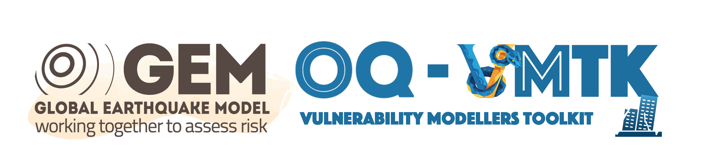

<!-- Improved compatibility of back to top link: See: https://github.com/othneildrew/Best-README-Template/pull/73 -->
<a id="readme-top"></a>
<!--
*** Thanks for checking out the Best-README-Template. If you have a suggestion
*** that would make this better, please fork the repo and create a pull request
*** or simply open an issue with the tag "enhancement".
*** Don't forget to give the project a star!
*** Thanks again! Now go create something AMAZING! :D
-->


<!-- PROJECT SHIELDS -->
<!--
*** I'm using markdown "reference style" links for readability.
*** Reference links are enclosed in brackets [ ] instead of parentheses ( ).
*** See the bottom of this document for the declaration of the reference variables
*** for contributors-url, forks-url, etc. This is an optional, concise syntax you may use.
*** https://www.markdownguide.org/basic-syntax/#reference-style-links
-->

[![Contributors][contributors-shield]][contributors-url]
[![Forks][forks-shield]][forks-url]
[![Stargazers][stars-shield]][stars-url]
[![Issues][issues-shield]][issues-url]
[]


<!-- PROJECT LOGO -->
<br />
<div align="center">
  <a href="https://github.com/GEMScienceTools/vulnerability-toolkit">
    
  </a>

  <h3 align="center">Vulnerability Toolkit</h3>

  <p align="center">
    A repository for modelling and analysing representative single- and multi-degree-of-freedom systems for response characterisation of regional building classes
    <br />
    <a href="https://github.com/GEMScienceTools/vulnerability-toolkit"><strong>Explore the docs »</strong></a>
    <br />
    <br />
    <a href="https://github.com/GEMScienceTools/vulnerability-toolkit/examples">View Demos</a>
    ·
    <a href="https://github.com/othneildrew/Best-README-Template/issues/new?labels=bug&template=bug-report---.md">Report Bug</a>
    ·
    <a href="https://github.com/othneildrew/Best-README-Template/issues/new?labels=enhancement&template=feature-request---.md">Request Feature</a>
  </p>
</div>


<!-- TABLE OF CONTENTS -->
<details>
  <summary>Table of Contents</summary>
  <ol>
    <li>
      <a href="#about-the-project">About The Project</a>
      <ul>
        <li><a href="#built-with">Built With</a></li>
      </ul>
    </li>
    <li>
      <a href="#getting-started">Getting Started</a>
      <ul>
        <li><a href="#prerequisites">Prerequisites</a></li>
        <li><a href="#installation">Installation</a></li>
      </ul>
    </li>
    <li><a href="#usage">Usage</a></li>
    <li><a href="#roadmap">Roadmap</a></li>
    <li><a href="#contributing">Contributing</a></li>
    <li><a href="#license">License</a></li>
    <li><a href="#contact">Contact</a></li>
    <li><a href="#acknowledgments">Acknowledgments</a></li>
  </ol>
</details>


<!-- ABOUT THE PROJECT -->
## About The Toolkit

[![Product Name Screen Shot][product-screenshot]](https://example.com)

The **Vulnerability-Toolkit** is an open source library that provides modelling of multi-degree-of-freedom systems and assessment via nonlinear time-history analyses for vulnerability and risk calculations. The **Vulnerability-Toolkit** is developed by the **[GEM](http://www.globalquakemodel.org)** (Global Earthquake Model) Foundation and its collaborators.

Features include:
* Modelling: Model representative single-degree-of-freedom oscillators or multi-degree-of-freedom (stick-and-mass) systems;
* Analysis:
  * Gravity analysis
  * Modal analysis
  * Nonlinear pushover analyses: static and cyclic
  * Dynamic analyses

* Postprocessing:
  * Cloud analysis
  * Fragility analysis
  * Vulnerability analysis

* Plotting:
  * Model plotting
  * Cloud analysis regression
  * Demand profiles: peak storey drift and peak floor acceleration quantities
  * Fragility functions

<p align="right">(<a href="#readme-top">back to top</a>)</p>


<!-- GETTING STARTED -->
## Getting Started

This is an example of how you may give instructions on setting up your project locally.
To get a local copy up and running follow these simple example steps.

### Prerequisites

This is an example of how to list things you need to use the software and how to install them.
* openseespy
  ```sh
  pip install openseespy
  ```
* eqsig
  ```sh
  pip install eqsig
  ```

### Installation

_Below is an example of how you can instruct your audience on installing and setting up your app. This template doesn't rely on any external dependencies or services._

1. Get a free API Key at [https://example.com](https://example.com)
2. Clone the repo
   ```sh
   git clone https://github.com/github_username/repo_name.git
   ```
3. Install NPM packages
   ```sh
   npm install
   ```
4. Enter your API in `config.js`
   ```js
   const API_KEY = 'ENTER YOUR API';
   ```
5. Change git remote url to avoid accidental pushes to base project
   ```sh
   git remote set-url origin github_username/repo_name
   git remote -v # confirm the changes
   ```

<p align="right">(<a href="#readme-top">back to top</a>)</p>


<!-- USAGE EXAMPLES -->
## Usage

Use this space to show useful examples of how a project can be used. Additional screenshots, code examples and demos work well in this space. You may also link to more resources.

_For more examples, please refer to the [Documentation](https://example.com)_

<p align="right">(<a href="#readme-top">back to top</a>)</p>


<!-- ROADMAP -->
## Roadmap

- []

See the [open issues](https://github.com/GEMScienceTools/vulnerability-toolkit/issues) for a full list of proposed features (and known issues).

<p align="right">(<a href="#readme-top">back to top</a>)</p>


<!-- CONTRIBUTING -->
# 🤔 Frequently asked questions

### How to contribute?

You can follow the instructions indicated in the [contributing guidelines](./contribute_guidelines.md). (Work-In-Progress)

### Which version am I seeing? How to change the version?

By default, you will see the files in the repository in the `main` branch. Each version of the model that is released can be accessed is marked with a `tag`. By changing the tag version at the top of the repository, you can change see the files for a given version.

Note that the `main` branch could contain the work-in-progress of the next version of the model.

### Top contributors:

<a href="https://github.com/GEMScienceTools/vulnerability-toolkit/graphs/contributors">
  
</a>

<p align="right">(<a href="#readme-top">back to top</a>)</p>


<!-- LICENSE -->
## © License

This work is licensed under an AGPL v3 license (https://www.gnu.org/licenses/agpl-3.0.en.html)

[](https://www.gnu.org/licenses/agpl-3.0)


<!-- CONTACT -->
## Contact

Al Mouayed Bellah Nafeh - [@linkedin](https://www.linkedin.com/in/al-mouayed-bellah-nafeh/) - mouayed.nafeh@globalquakemodel.org
Karim Aljawhari - [@linkedin](https://www.linkedin.com/in/karimaljawhari/) - karim.aljawhari@globalquakemodel.org

Project Link: [https://github.com/your_username/repo_name](https://github.com/your_username/repo_name)

<p align="right">(<a href="#readme-top">back to top</a>)</p>


<!-- ACKNOWLEDGMENTS -->
## Acknowledgments

Use this space to list resources you find helpful and would like to give credit to. I've included a few of my favorites to kick things off!

* [Choose an Open Source License](https://choosealicense.com)
* [GitHub Emoji Cheat Sheet](https://www.webpagefx.com/tools/emoji-cheat-sheet)
* [Malven's Flexbox Cheatsheet](https://flexbox.malven.co/)
* [Malven's Grid Cheatsheet](https://grid.malven.co/)
* [Img Shields](https://shields.io)
* [GitHub Pages](https://pages.github.com)
* [Font Awesome](https://fontawesome.com)
* [React Icons](https://react-icons.github.io/react-icons/search)

<p align="right">(<a href="#readme-top">back to top</a>)</p>


<!-- MARKDOWN LINKS & IMAGES -->
<!-- https://www.markdownguide.org/basic-syntax/#reference-style-links -->
[contributors-shield]: https://img.shields.io/github/contributors/othneildrew/Best-README-Template.svg?style=for-the-badge
[contributors-url]: https://github.com/othneildrew/Best-README-Template/graphs/contributors
[forks-shield]: https://img.shields.io/github/forks/othneildrew/Best-README-Template.svg?style=for-the-badge
[forks-url]: https://github.com/othneildrew/Best-README-Template/network/members
[stars-shield]: https://img.shields.io/github/stars/othneildrew/Best-README-Template.svg?style=for-the-badge
[stars-url]: https://github.com/othneildrew/Best-README-Template/stargazers
[issues-shield]: https://img.shields.io/github/issues/othneildrew/Best-README-Template.svg?style=for-the-badge
[issues-url]: https://github.com/othneildrew/Best-README-Template/issues
[license-shield]: https://img.shields.io/github/license/othneildrew/Best-README-Template.svg?style=for-the-badge
[license-url]: https://github.com/othneildrew/Best-README-Template/blob/master/LICENSE.txt
[linkedin-shield]: https://img.shields.io/badge/-LinkedIn-black.svg?style=for-the-badge&logo=linkedin&colorB=555
[linkedin-url]: https://linkedin.com/in/othneildrew
[product-screenshot]: images/screenshot.png
[Next.js]: https://img.shields.io/badge/next.js-000000?style=for-the-badge&logo=nextdotjs&logoColor=white
[Next-url]: https://nextjs.org/
[React.js]: https://img.shields.io/badge/React-20232A?style=for-the-badge&logo=react&logoColor=61DAFB
[React-url]: https://reactjs.org/
[Vue.js]: https://img.shields.io/badge/Vue.js-35495E?style=for-the-badge&logo=vuedotjs&logoColor=4FC08D
[Vue-url]: https://vuejs.org/
[Angular.io]: https://img.shields.io/badge/Angular-DD0031?style=for-the-badge&logo=angular&logoColor=white
[Angular-url]: https://angular.io/
[Svelte.dev]: https://img.shields.io/badge/Svelte-4A4A55?style=for-the-badge&logo=svelte&logoColor=FF3E00
[Svelte-url]: https://svelte.dev/
[Laravel.com]: https://img.shields.io/badge/Laravel-FF2D20?style=for-the-badge&logo=laravel&logoColor=white
[Laravel-url]: https://laravel.com
[Bootstrap.com]: https://img.shields.io/badge/Bootstrap-563D7C?style=for-the-badge&logo=bootstrap&logoColor=white
[Bootstrap-url]: https://getbootstrap.com
[JQuery.com]: https://img.shields.io/badge/jQuery-0769AD?style=for-the-badge&logo=jquery&logoColor=white
[JQuery-url]: https://jquery.com

# 📑 References

TBD
